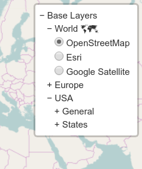

# Leaflet.Control.Layers.Tree
[](https://travis-ci.org/jjimenezshaw/Leaflet.Control.Layers.Tree)

A Tree Layers Control for Leaflet.

## Description
This plugin extends [`Control.Layers`](http://leafletjs.com/reference-1.2.0.html#control-layers) allowing a tree structure for the layers layout. In `Control.Layers` you can only display a flat list of layers (baselayers and overlays), that is usually enough for small sets. If you have a long list of baselayers or overlays, and you want to organize them in a tree (allowing the user collapse and expand branches), this is a good option.

## Installation
Using npm for browserify `npm install leaflet.control.layers.tree` (and `require('leaflet.control.layers.tree')`), or just download `L.Control.Layers.Tree.js` and `L.Control.Layers.Tree.css` and add a script and link tag for it in your html.

## Compatibility
This plugin has been tested with Leaflet 1.0.3, 1.1.0 and 1.2.0.

## Usage
1. Create your layers. Do this as usual.
2. Create your layers tree, like the one just below.
3. Create the control and add to the map: `L.control.layers.tree(baseTree, overalysTree, options).addTo(map);`
4. Voilà!
```javascript
var baseTree = {
    label: 'Base Layers',
    noShow: false,
    children: [
        {
            label: 'World &#x1f5fa;',
            children: [
                { label: 'OpenStreetMap', layer: osm },
                { label: 'Esri', layer: esri },
                { label: 'Google Satellite', layer: g_s },
                /* ... */
            ]
        },
        {
            label: 'Europe',
            children: [
                { label: 'France', layer: france },
                { label: 'Germany', layer: germany },
                { label: 'Spain', layer: spain },
                /* ... */
            ]
        },
        {
            label: 'USA',
            children: [
                {
                    label: 'General',
                    children: [
                        { label: 'Nautical', layer: usa_naut },
                        { label: 'Satellite', layer: usa_sat },
                        { label: 'Topographical', layer: usa_topo },
                    ]
                },
                {
                    label: 'States',
                    children: [
                        { label: 'CA', layer: usa_ca },
                        { label: 'NY', layer: usa_ny },
                        /* ... */
                    ]
                }
            ]
        },
    ]
};
```


## API
### `L.Control.Layers.Tree`
The main (and only) 'class' involved in this plugin. It exteds `L.Control.Layers`, so most of its methods are available. `addBaseLayer`, `addOverlay` and `removeLayer` are non usable in `L.Control.Layers.Tree`.
#### `L.control.layers.tree(baseTree, overlaysTree, options)`
Creates the control. The arguments are:
* `baseTree`: Tree defining the base layers (like the one above).
* `overlaysTree`: Similar than baseTree, but for overlays.
* `options`: specific options for the tree. See that it includes `L.Control.Layer` [options](http://leafletjs.com/reference-1.2.0.html#control-layers)

##### constructor options
* `closedSymbol`: `<String>` Symbol displayed on a closed node (that you can click to open). Default '+'
* `openedSymbol`: `<String>` Symbol displayed on a opened node (that you can click to close). Default '&minus;' (`&minus;`)
* `spaceSymbol`: `<String>` Symbol between the closed or opened symbol, and the text. Default ' ' (a normal space)
* `selectorBack`: `<Boolean>` Flag to indicate if the selector (+ or &minus;) is _after_ the text. Default 'false'
* `namedToggle`: `<Boolean>` Flag to replace the toggle image (box with the layers image) with the 'name' of the selected base layer. If the `name` field is not present in the tree for this layer, `label` is used. See that you can show a different name when control is collapsed than the one that appears in the tree when it is expanded. Your node in the tree can be `{ label: 'OSM', name: 'OpenStreetMap', layer: layer }`. Default 'false'
* `collapseAll`: `<String>` Text for an entry in control that collapses the tree (baselayers or overlays). If empty, no entry is created. Default ''
* `expandAll`: `<String>` Text for an entry in control that expands the tree. If empty, no entry is created. Default ''

See that those strings can be html code, with unicode, images or whatever you want.

#### `expandTree(overlays)`
This method expands the tree. When `overlays` is `true` expands the overlays tree. Otherwise expands the baselayers tree. Returns `this`.


#### `collapseTree(overlays)`
This method collapses the tree. When `overlays` is `true` collapses the overlays tree. Otherwise collapses the baselayers tree. Returns `this`.

#### `expandSelected(overlays)`
This method expands only the selected item in the tree. When `overlays` is `true` affects the overlays tree. Otherwise affects the baselayers tree. Returns `this`.

## Tricks about the tree
You can see an example of a baselayers tree (the javascript code) above. As every tree, you need a root node. If you don't want the root node to be displayed, but directly show its nodes in the control, add the attribute `noShow: true`. That makes sense only in the root node.

Non leaf nodes (that is, those with `children`) can also have a layer. In this case you will be able to select the layer, and only the icon will collapse or expand this branch.

You can include HTML code, not only ascii chars, in the `label` attribute. It will be included as `innerHTML`. Be carefull with unicodes, because not every browser supports them all.

A leaf node without `layer` attribute is also posible. Only with `label`. This can be used to include special commands calling a javascript function, or a separator, or whatever you like.
